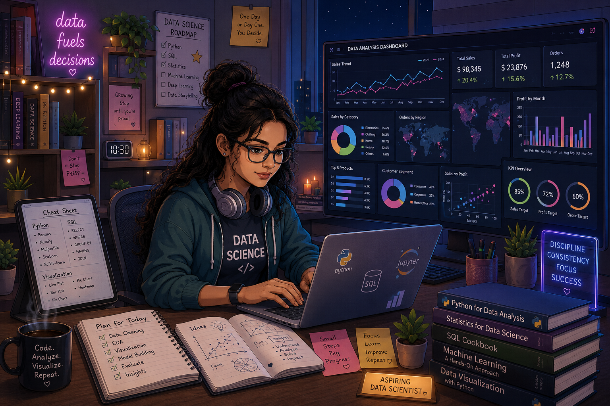

<table>
<tr>

<td width="55%" valign="top">

# 👋 Hi, I'm Seema Das

### 🚀 Aspiring Data Scientist

💻 **Python • SQL • Power BI • Machine Learning**

I'm a Computer Science postgraduate passionate about transforming raw data into meaningful insights through **Data Analysis, Exploratory Data Analysis (EDA), Visualization, and Machine Learning**. I enjoy solving real-world business problems by building practical data science projects and continuously improving my analytical skills.

---

## 👩‍💻 About Me

🎓 M.Tech in Computer Science

📊 Aspiring Data Scientist

💻 Building Real-world Data Science Projects

📈 Passionate about EDA & Data Visualization

🌱 Currently Learning Machine Learning & Statistics

🎯 Open to Data Analyst / Data Scientist Opportunities

---

## 🛠️ Tech Stack

### 👨‍💻 Programming

### 📊 Data Analysis

### 📈 Data Visualization

### 🛠️ Tools

</td>

<td width="45%" align="center">

</td>

</tr>
</table>

---

# 📂 Featured Projects

### ❤️ Heart Disease Analysis
✔ Data Cleaning  
✔ Exploratory Data Analysis  
✔ Data Visualization  
✔ Healthcare Insights  

---

### 🛍️ Diwali Sales Analysis

✔ Customer Behaviour Analysis

✔ Sales Insights

✔ Python + SQL

✔ Business Intelligence

---

### 🏪 Walmart Sales Analysis

✔ SQL Queries

✔ Business Analysis

✔ Sales Performance

✔ Data Exploration

---

### 🚕 Uber Data Analysis

✔ Data Cleaning

✔ EDA

✔ Visualization

---

# 📚 Currently Learning

- Exploratory Data Analysis (EDA)
- Statistics for Data Science
- Machine Learning
- Feature Engineering
- Model Evaluation
- AI/ML Applications

---

# 🎯 2026 Goals

✅ Build 20+ Data Science Projects

✅ Master Python & SQL

✅ Learn Advanced Machine Learning

✅ Contribute to Open Source

✅ Build an Outstanding Data Science Portfolio

✅ Start My Career as a Data Analyst / Data Scientist

---

# 📫 Connect With Me

📧 **Email:** seemagitima11@gmail.com

💼 **LinkedIn:** https://www.linkedin.com/in/seema-das11/

🐙 **GitHub:** https://github.com/SeemaGitima

---

### ⭐ Thanks for visiting my profile!

*"Turning data into meaningful insights, one project at a time."* 📊

